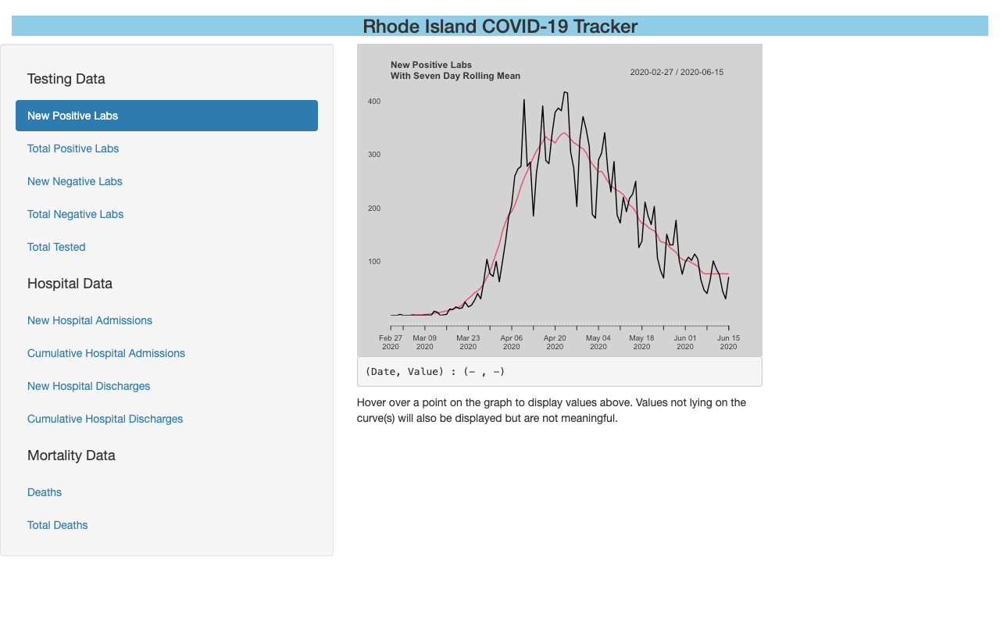

# RICOVID19
R Shiny app for visualizing State of Rhode Island Covid-19 data

This is a work in progress. It uses publicly available data provided by the State of Rhode Island and the
Rhode Island Department of Health. That data can be accessed here:
https://docs.google.com/spreadsheets/d/1n-zMS9Al94CPj_Tc3K7Adin-tN9x1RSjjx2UzJ4SV7Q/edit#gid=590763272

The Rhode Island Department of Health's own official Covid-19 Data tracker can be accessed here:
https://ri-department-of-health-covid-19-data-rihealth.hub.arcgis.com/

If you're looking for the official public record of Covid-19 testing and cases in the state of Rhode Island,
please consult the official data tracker maintained by the Rhode Island Department of Health. This tracker is a personal
project and does not supplant or compete with the tracker maintained by the Rhode Island Department of Health.
***

